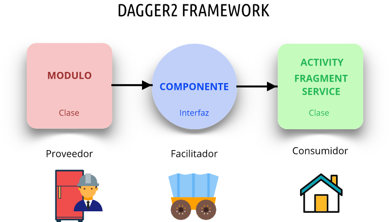

# Inyección de Dependencias con Dagger

## Inyección de Dependencias (DI)

La inyección de dependencias es una técnica de desarrollo que permite a los desarrolladores de software, a través de la inyección de dependencias, obtener una dependencia de una clase en una clase que no tiene acceso a ella.

El Principio de inyección de dependencia no es más que poder pasar (inyectar) las dependencias cuando sea necesario en lugar de inicializar las dependencias dentro de la clase receptora y con ello poder desacoplar la construcción de sus clases de la construcción de las dependencias de sus clases.

Es decir, aplicamos una composición entre clases, con el objetivo que cada clase tenga sus responsabilidades bien definidas y acotadas. Es decir, si una clase A, necesita alguna funcionalidad de B, nosotros al crear A, debemos "inyectarle" B. De esta manera A, puede usar la funcionalidad de B. 

De esta manera, podemos cambiar B, por C, siempre y cuando mantengan el contrato que permite ser usado por A. Ya no es la clase A la responsable de definir sus dependencias sino que lo es el programa o clase superior que le inyecta la dependencia que en ese momento necesite según los requerimientos.

## ¿Qué es Dagger?
Es un Framework creado inicialmente por Square y actualmente mantenido por Google para aplicaciones Java/Kotlin y Android cuyo principal objetivo es facilitar la implementación del patrón de diseño de Inyección de Dependencias, en otras palabras, se busca que sea Dagger2 el responsable de crear y administrar la creación de objetos en toda la aplicación.
Podemos resumir el funcionamiento de Dagger2 en el siguiente diagrama:

Tendremos un **Proveedor**, es el encargado de definir cómo se construyen las dependencias. En Dagger2 utilizamos ***Módulos*** y cada módulo es una clase que tiene el manejo de la creación de dichas dependencias.

En consecuencia tenemos un **Consumidor**, quien es el que necesita de ciertas dependencias que solicitará al **Proveedor** por medio de un **Facilitador**.

Y muy importante el **Facilitador**, que utiliza ***Componentes***, los cuáles se encargan de permitir el acceso a las dependencias creadas para su uso a los **Consumidores**. Dagger2 es quien se encarga mayoritariamente de implementar esta parte del Framework.

Las siguientes anotaciones le permiten a Dagger2 identificar a través de toda la aplicación qué, cómo y dónde debe realizar la inyección de dependencias:
- **@Module** Identifica qué clases son las encargadas de construir dependencias. Se indica como anotación arriba de la clase. Será ***Proveedores*** de dependencias.
- **@Provides** Utilizado dentro de una clase con anotación *@Module* para indicar individualmente el objeto que provee una dependencia. Se indica como anotación arriba de un método. Lo usaremos para implementar casos concretos, o con librerías de terceros.
- **@Bind** Utilizado dentro de una clase con anotación *@Module* para indicar individualmente el objeto que provee una dependencia. Se utiliza cuando sabemos que son interfaces y no se necesita una implementación concreta de los mismos. Para ello nuestro ***Modulo*** debe ser una interfaz o clase abstracta.
- **@Component** Indica cuales son las dependencias que van a estar a disposición de los ***Consumidores*** a través de ***Módulos*** u ***Objetos***. Se indica como anotación arriba de una interfaz.
- **@Inject** Dentro del ***Consumidor*** (Activity, Fragment, otra clase) se indica ya sea en un Miembro (atributo, campo), función o constructor de la clase, y permite identificar las dependencias que van a ser inyectadas.
- **@Singleton** Si deseamos que las instancia que nos proporciona Dagger 2 sea Singleton bastará con anotar la clase o el método ***@Provides*** con ***@Singleton***. En el primer caso, siempre que lo necesitemos, devolverá el mismo objeto. En el segundo caso, solo lo tratará así en el módulo donde generemos la dependencia.
- **@Named** En ocasiones necesitaremos inyectar distintas implementaciones de un interface por lo que usaremos varios métodos ***@Provides*** anotándolos con ***@Named***.
- **Lazy** Si el coste de instanciar un objeto es alto y no siempre se llega a utilizar, podemos indicar su instanciación como Lazy y no se creará hasta la primera vez que se utilice, para usarlo debemos usar ***get()*** en el método que lo utiliza.
- **Provider** En ocasiones queremos una instancia nueva del objeto cada vez que la utilicemos. Para ello usamos un Provider en el atributo que queramos. Lo recuperaremos con ***get()***.
